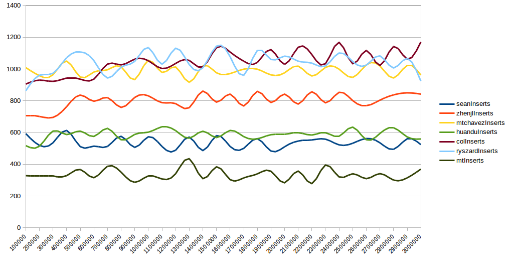
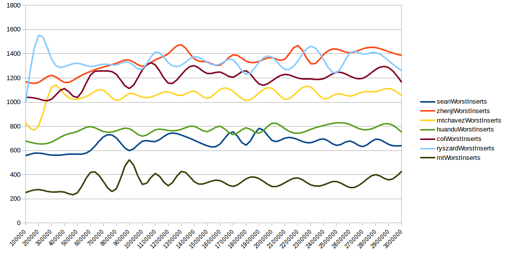
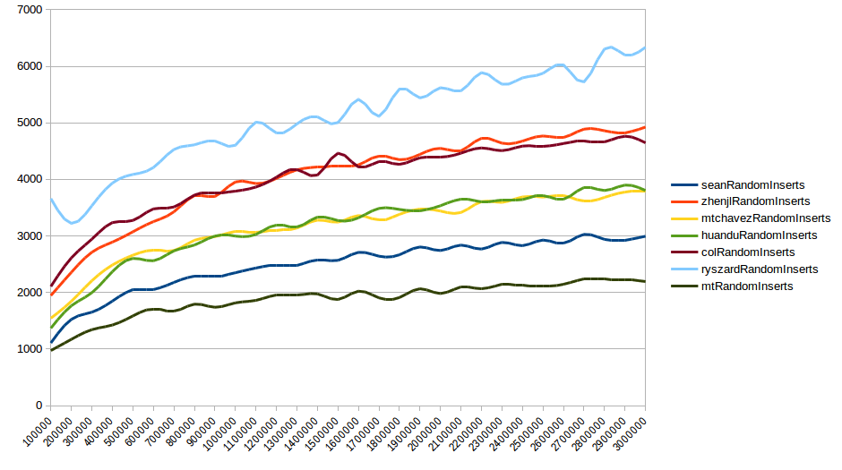
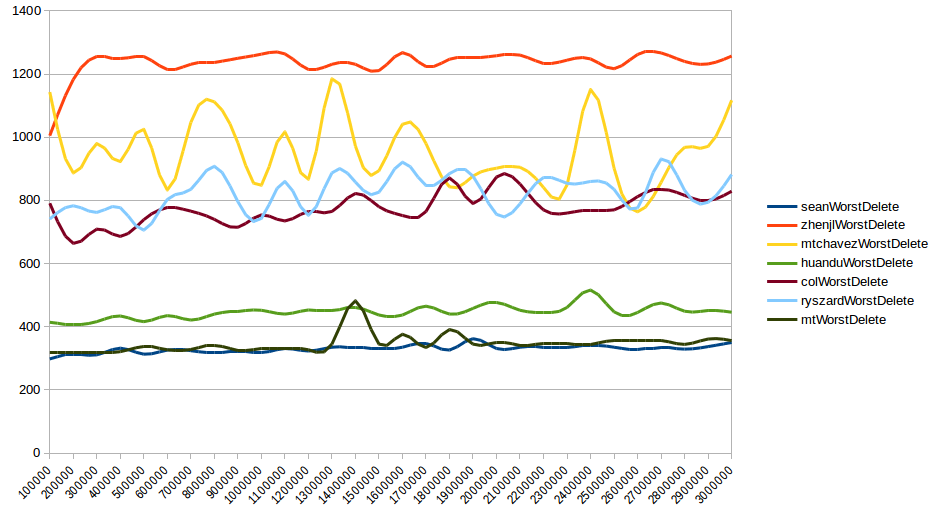
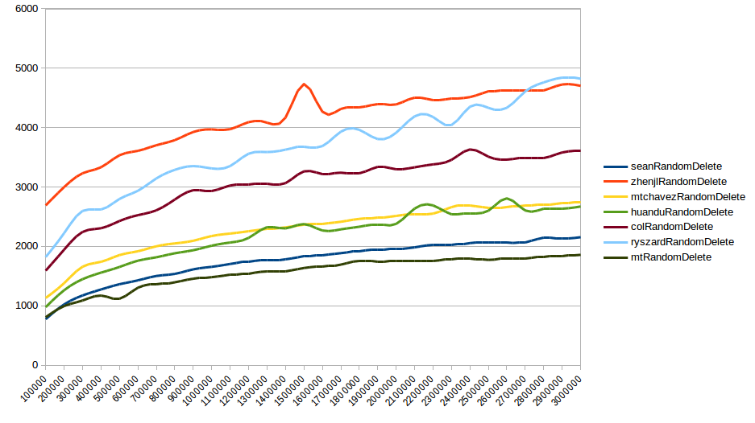

## Survey of Skip List Implementations


Here is a brief summary of skip list packages available in Go that you may consider using after a quick Google/Github search. If you know of any others, please contact me so I can add them here.

Some things most of the packages have in common:

- Keys are `int` type, which are 32 or 64 bit depending on GOARCH
- Values are generally of type `interface {}`, so they accept any datatype (Go does not have generics).
- The probability of adding new nodes to each linked level is *P*. The values vary from 0.25 to 0.5. This is an important parameter for performance tuning and memory usage.


Here are some brief notes on each implementation:

- [github.com/mtchavez/skiplist](https://github.com/mtchavez/skiplist)
  - Values are type `[]byte`, which almost always means conversion.
  - Global constant for *P* value = 0.25, cannot be changed at runtime.
- [github.com/huandu/skiplist](https://github.com/huandu/skiplist)
  - Globally sets *P* to *almost* 0.25 (using bitmasks and shifting) and can be changed at runtime.
  - You must specify a comparator and type for keys when creating the list.
  - Keys are of type `interface{}`
  - Not threadsafe
- [github.com/zhenjl/skiplist](https://github.com/zhenjl/skiplist)
  - Adjustable *P* value and max level per list.
  - Adjustable insert level probability per list.
  - Allows duplicates stored at a single key and therefore does not have an update operation.
  - When creating a list, you specify a comparator. It has many built-in that are generated by running an external script that writes out a Go source file with the interfaces.
  - Uses separate search and insert fingers to speed up finding highly local keys consecutively.
  - Threadsafe but fingers are shared as well across all lists
- [github.com/golang-collections/go-datastructures/slice/skip](https://github.com/golang-collections/go-datastructures/)
  - Intelligently sets maximum level based on key's datatype (uint8 up to uint64)
  - More complex interface; you must define an Entry type that implements the interface it specifies with a comparator
  - *P* value is a global constant, 0.5
- [github.com/ryszard/goskiplist](https://github.com/ryszard/goskiplist)
  - P value is a global constant, 0.25
  - Very straightforward implementation and interface
  - Not threadsafe
- [github.com/sean-public/fast-skiplist](https://github.com/sean-public/fast-skiplist)
  - Counting only concurrent implementations, `sean`  is the fastest.
  - Overall it is always the second fastest in all benchmarks (With a few on-par with `MauriceGit`) and `huandu` coming very close in most benchmarks.
  - See fast-skiplist's README for details on how this is achieved.
- [github.com/MauriceGit/skiplist](https://github.com/MauriceGit/skiplist)
  - Fastest non-concurrent implementation over all benchmarks. `sean` is on-par regarding **search** and **worstDelete**.
  - Not threadsafe
  - Entry type needs to be defined, that implements two simple methods for key extraction and printing.
  - *P* value can not be set as the calculated level-height is calculated in O(1) instead of normal O(n) coin flips (See repository for detailed implementation).
  - Only one call to the random number generator is needed per insert! (Instead of the #height generated).
  - Convenience functions to retrieve next and previous elements are implemented as well as a method to change values in the list without the need of re-insertion.

### Benchmarks

Running the benchmarks found in this repo locally is easy:

```sh
go get github.com/sean-public/skiplist-survey
go install github.com/sean-public/skiplist-survey
skiplist-survey > output.csv
```

The results are in CSV format for easy charting and analysis.

Here is a summary of results I recorded on a Macbook Pro 15 with a 2.7 GHz Intel Core i7 and 16GB RAM. It takes over an hour to run all the benchmarks.

The vertical axis is **nanoseconds per operation**, the horizontal is the number of items in the list.




**Best-case insert**. These are the "best" inserts because they happen at the front of the list, which shouldn't require any searching. The difference in speed here demonstrates the overhead each package introduces in even the most basic operations.




**Worst-case inserts.** These inserts are at the end of the list, requiring searching all the way to the end and then adding the new node. Even though all implementations only show a small variance even after millions of nodes are added, we can still see very large differences in overall speed because of implementation overhead.




**Random inserts.** The inserts are at random positions in the skiplist, making this the closest real-world case for inserts. The approximately logarithmic behaviour is clearly visible for all implementations even though the overhead makes `ryszard` take 3x as long as `mauriceGit (mt)`.


**Average search speed**. `mtchavez`, `sean` and `mauriceGit (mt)` are approximately equally fast. `zhenjl` seems to introduce some serious overhead, making it more than 8x as slow as the fastest implementations.




**Worst case deletions**. In this benchmark, a skip list of a given length is created and then every item is removed, starting from the last one and moving to the front.
`mauriceGit (mt)` and `sean` are around equally fast with around 100ns faster than the next contestant (`huandu`).




**Random deletions**. Elements are removed from random positions in the skiplist. For Deletions, this is the closest to a real-world case. We can clearly see the the logarithmic behaviour, even though some implementations have a large overhead involved.
Just like for randomInserts, `mauriceGit (mt)` is the fastest, closely followed by `sean`.


### Todo

- (in progress now) Add multithreaded benchmarks with varying concurrency and read/write load proportions.

- Use very tall (max height) skiplists to demonstrate stress caused by multiple calls to random functions on insert.

- Record total and high-water mark memory use.

- Benchmark concurrent inserts on multiple lists to stress globally-locked PRNG in most implementations.

  ​
